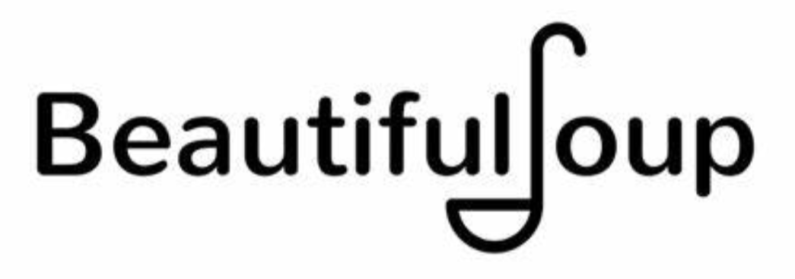

```{r, eval=TRUE, include=TRUE, echo=FALSE, message=FALSE, warning=FALSE}
# regarding `library()`: you don't have to `library(knitr)` if you `knitr::`
knitr::opts_chunk$set(eval=TRUE, include=TRUE, echo=TRUE, message=FALSE, warning=FALSE)

# knitting will default to pdf (rather than, e.g., html)
knitr::opts_chunk$set(dev='pdf')

# Defines a new code chunk `parameter=argument` option which will allow the
# size of printed code+output to be controlled using latex text size names:
# https://www.overleaf.com/learn/latex/Font_sizes%2C_families%2C_and_styles#Reference_guide
def.chunk.hook  <- knitr::knit_hooks$get("chunk")
knitr::knit_hooks$set(chunk = function(x, options) {
  x <- def.chunk.hook(x, options)
  ifelse(options$size != "normalsize", paste0("\n \\", options$size,"\n\n", x, "\n\n \\normalsize"), x)
})

color_block = function(color) {
  function(x, options) sprintf('\\color{%s}\\begin{verbatim}%s\\end{verbatim}',
                               color, x)
}
knitr::knit_hooks$set(message = color_block('red'))
knitr::knit_hooks$set(warning = color_block('red'))
knitr::knit_hooks$set(error = color_block('red'))
```

## Olympics, PEDs, and The WADA

```{r, eval=FALSE, include=FALSE}
download.file(url = "https://upload.wikimedia.org/wikipedia/commons/thumb/5/5c/Olympic_rings_without_rims.svg/1200px-Olympic_rings_without_rims.svg.png",
              destfile = "images/olympics.png", mode = 'wb')
download.file(url = "https://www.wada-ama.org/sites/default/files/styles/fullscreen/public/2022-01/wada-logo-en.jpg",
              destfile = "images/wada.jpg", mode = 'wb')
```

:::columns
::::column

|{width=250px}|
|-|
|{width=250px}|

::::
::::column

\small 

\vspace{.15cm}

Performance enhancing drugs (PEDs) controversy is not uncommon for Olympic athletes.  The World Anti-Doping Agency (WADA) -- based in Montreal, Quebec -- is tasked by the Olympic committee to establish and enforce PED policies; and, ["The agency's key activities include scientific research."](https://en.wikipedia.org/wiki/World_Anti-Doping_Agency)

\vspace{.15cm}
Routine testing and data collected by WADA can be used to study the violation rates with respect to sports and countries. WADA scientists are also ideally placed to study human health and exercise performance.  WADA sponsored scientific studies are publicly available through official WADA publications, media outlets interviewing WADA scientists and reporting their results, and in peer-reviewed scientific journals. 

::::
:::

## Olympics, PEDs, and The WADA

\footnotesize

### What is the most appropriate assessment of the ethical responsibility of WADA with respect to its scientific activities?

\small

\vspace{.15cm}
A. When WADA sponsors and participates in scientific studies, and subsequently engages in efforts to disseminate this information to the public, they are necessarily taking actions with ethical implications and are thus responsible for ensuring that their scientific efforts are carried out in an manner that is consistent with ethical scientific research practices.

\vspace{.15cm}
B. Because WADA collects data on publicly observed sports, they are responsible for making it available to the public, and when they release their data (as required) they must be sure to anonymize it by removing the names of athletes so that there is no violation of the re-identification principle.

\vspace{.15cm}
C. While the Olympics and WADA impact society through the public activities they organize, they do not have Institutional Review Boards (IRBs) like universities, and so they are not subject to the same ethical considerations and standards as academic research at universities.

\vspace{.15cm}
D. The Olympics and WADA are private organizations, and thus their enterprises and activities are not subject to the same ethical standards and considerations that are required of public organizations or publicly funded scientific research projects.

## Morals versus Ethics

```{r, eval=FALSE, include=FALSE}
download.file(url = "https://www.eyeforfilm.co.uk/images/newsite/Light_of_My_Life_poster.jpg",
              destfile = "images/light.jpg", mode = 'wb')
```

:::columns
::::column

\footnotesize 

Dad. \hspace{.1cm} What?

\vspace{.1cm}
What's the difference
between morals and ethics?

\vspace{.1cm}
Well, a moral's an idea...
hmm, about right and wrong.
And ethics are how those morals
apply to specific situations.

\vspace{.1cm}
Like it's wrong to kill someone,
but if they're gonna
kill ten people,
is it okay to kill them?
I don't know why I use this
as the example, it's very

\vspace{.1cm}
-- Pretty violent

\vspace{.1cm}
But it's kind of an...
uh, obvious moral.

\vspace{.1cm}
\tiny

This guy Luke,
in my book,
he has really bad morals
and ethics.
Both.

\vspace{.05cm}
Huh.
How is he immoral and unethical?

\vspace{.05cm}
'Cause he's really bad.
He lies to protect himself,
and then he doesn't lie
when he could lie
to not break Lilly's heart.

\vspace{.05cm}
I understand that.
What do you think he would say
to defend his own choices?

\vspace{.05cm}
Um...
Uh, well, maybe he feels bad
about lying the first time.
And so he doesn't lie
the second time,
even though that would be
the right ethic.

\vspace{.05cm}
Uh-huh.
So he would defend
his choice by saying
that he learned lying was wrong,
so now he wants to always
tell the truth.

\vspace{.05cm}
Okay.
So he would be right
morally but not ethically

::::
::::column

{width=225px}

::::
:::


## Personal Ethics

Data science gains new insights by tying together existing disconnected data sets

\vspace{-.5em}
- For publicly available data this generally receives very little formal review


\begin{block}{As ethical Statisticians and Data Scientists it is mostly up to us to:}

\small 

\vspace{-.75em}
\begin{itemize} 
\setlength\itemsep{-.5em}
\item be accurate in our analyses and conclusions
\item  be honest in reporting our results even if they're not what we hoped they'd be
\item  be alert to possible consequences of our results and recommendations 
\item  be respectful of other well-conducted work even if it contradicts our own work
\item  share credit when our work is based on the ideas of others
\end{itemize}

\vspace{.5em}
\end{block}

\scriptsize
\vspace{-2.5em}
Based on the Ethics Guidelines from the [Statistical Society of Canada](https://ssc.ca/sites/default/files/data/Members/public/Accreditation/ethics_e.pdf) and the [American Statistical Association](https://www.amstat.org/ASA/Your-Career/Ethical-Guidelines-for-Statistical-Practice.aspx).


\small 

\vspace{-.05cm}

### The Data Science Oath (National Academies of Science, Engineering, and Medicine)

\vspace{-.5em}
1. I will not be ashamed to say, “I know not,” nor will I fail to call in my colleagues when 
the skills of another are needed for solving a problem.
2. I will respect the privacy of my data subjects, for their data are not disclosed to me 
that the world may know, so I will tread with care in matters of privacy and security.
3. I will remember that my data are not just numbers without meaning or context, but 
represent real people and situations, and that my work may lead to unintended 
societal consequences, such as inequality, poverty, and disparities due to algorithmic 
bias.


## Webscraping

URLs, HTML, CSS, and packages like [polite](https://github.com/dmi3kno/polite#polite-) and [rvest](https://rvest.tidyverse.org/) or [Beautiful Soup](https://beautiful-soup-4.readthedocs.io/en/latest/)

```{r, eval=FALSE, include=FALSE}
download.file(url = "https://rvest.tidyverse.org/logo.png",
              destfile = "images/rvest.png", mode = 'wb')
download.file(url = "https://miro.medium.com/max/1045/1*jN3vLj7R8m9BEpOJuMJT-w.png",
              destfile = "images/bs.png", mode = 'wb')
download.file(url = "https://github.com/dmi3kno/polite/raw/develop/man/figures/logo.png",
              destfile = "images/polite.png", mode = 'wb')
```

| | | |
|-|-|-|
| {width=75px} | {width=75px} | {width=200px} |

\vspace{-.75em}

- Websites have *Terms and Conditions* and rules in a file called [robots.txt](http://www.robotstxt.org/robotstxt.html)

I, the [ethical web scraper](https://towardsdatascience.com/ethics-in-web-scraping-b96b18136f01) live by the following principles:

\tiny 

- If you have a public API that provides the data I’m looking for, I’ll use it and avoid scraping all together.
- I will always provide a User Agent string that makes my intentions clear and provides a way for you to 
contact me with questions or concerns.
- I will request data at a reasonable rate. I will strive to never be confused for a DDoS (distributed denial of service) attack.
- I will only save the data I absolutely need from your page. If all I need it OpenGraph meta-data, that’s 
all I’ll keep.
- I will respect any content I do keep. I’ll never pass it off as my own.
- I will look for ways to return value to you. Maybe I can drive some (real) traffic to your site or credit 
you in an article or post.
- I will respond in a timely fashion to your outreach and work with you towards a resolution should you contact me with an issue.
- I will scrape for the purpose of creating new value from the data, not just to duplicate data.

## APIs

```{r, eval=FALSE, include=FALSE}
download.file(url = "https://www.howtogeek.com/wp-content/uploads/2018/03/api-defined-as-application-program-interface.jpeg",
              destfile = "images/api.jpeg", mode = 'wb')
```

[You don’t need to know HOW to make crème brûlée to want it and order it...](https://www.howtogeek.com/343877/what-is-an-api/)

|{width=400px}|
|-|
| |

> APIs have rules such as request and rate limits to know and follow 


## Societal Ethics

> The Nuremberg code was formulated in August 1947 in Nuremberg, Germany, by American 
judges judging Nazi doctors accused of conducting murderous and torturous 
human experiments in concentration camps during the war.

\vspace{1em}

\begin{block}{The Nuremberg code codified many standard principles for ethical research}

such as
\begin{itemize}
\item research must appropriately balance risk and potential benefits
\item researchers must be discipline experts and base work on animal trials
\end{itemize}

\vspace{1em}
\end{block}

\vspace{1em}

> "The voluntary consent of the human subject is absolutely essential... The duty and responsibility for ascertaining the quality of the consent rests upon each individual who initiates, directs, or engages in the experiment"

## Principles of free and informed consent

- **Information**: The research procedure, risks and anticipated benefits, alternative 
procedures (where therapy is involved), and a statement offering the participant the 
opportunity to ask questions and to withdraw at any time from the research.

- **Comprehension**: The manner and context in which information is conveyed is as 
important as the information itself. For example, presenting information in a 
disorganized or rapid manner (with too little time to think about it or ask questions) 
may limit a participant's ability to make an informed choice.

- **Voluntariness**: Agreement to participate in research constitutes valid consent only 
if it is voluntary based on conditions free of coercion and inappropriate influence.

```{r, eval=FALSE, include=FALSE}
download.file(url = "https://upload.wikimedia.org/wikipedia/commons/thumb/9/98/Information_magnifier_icon.png/1200px-Information_magnifier_icon.png",
              destfile = "images/info.png", mode = 'wb')
download.file(url = "https://www.giftstogive.org/wp-content/uploads/2014/04/Light-bulb-moment-200x200.jpg",
              destfile = "images/understand.jpg", mode = 'wb')
download.file(url = "https://cutewallpaper.org/24/thumbs-up-and-down-clipart/1150213233.jpg",
              destfile = "images/thumbs.jpg", mode = 'wb')
```

|{width=100px} |{width=100px} | {width=175px} |
|-|-|-|

## Olympics, PEDs, and The WADA

### Which of the ethical scientific research principles of free and informed consent, if any, is violated by WADA requiring Olympians to submit blood samples for the purposes of PED testing as a requirement to compete in the Olympics?

| Compensation principle| Comprehension principle | Information principle |
|-|-|-|
|  Re-identification principle | Voluntariness principle | None of the principles of free and informed consent are violated |


## Protecting Privacy

Consent given for YOU to see information doesn't mean EVERYONE ELSE can too

\begin{block}{Re-identification risks}
Information can be accidentally divulged!
\end{block}

:::columns
::::column

\footnotesize 

2013 NYC Taxi Commission released 173 million trips with anonymized medallion numbers

- Tockar (2014) combined these data with public celebrity blogs to find likely addresses of well-known actors and who frequented strip clubs
- Franceschi-Bicchierai (2015) could STILL identify sensitive information such 
as drivers' annual incomes, address, and if they followed devout Muslim prayer times
- Metcalfe and Crawford (2016) examine this further

::::
::::column

\footnotesize 

From [Baumer, Kaplan, and Horton (2021)](https://mdsr-book.github.io/mdsr2e/ch-ethics.html#data-and-disclosure):

$\quad$ When Massachusetts governor William Weld collapsed in 1996, an MIT graduate student connected this to public release data from the Massachusetts Group Insurance Commission to find Weld’s hospitalization records.

$\quad$ The (US) Health Insurance Portability and Accountability Act (HIPAA) was passed that same year defined 
regulations to ensure that protected health information (PHI) is protected when it is transferred, received, 
handled, analyzed, or shared by researchers and medical care providers.

::::
:::


## Olympics, PEDs, and The WADA

\vspace{.15cm}

### Suppose to participate in the Olympics, WADA requires athletes to allow any data collected on them to be used in WADA sponsored scientific research, and

\small 
\vspace{-.15cm}
- because of the dynamic exploratory nature of WADA sponsored scientific research, WADA cannot be specific about exactly how each Olympians data might be used in the future;

\vspace{-.25cm}

- therefore, the agreement with WADA includes the following considerations and stipulations:

  - all research projects must be reviewed and approved by both internal and external independent IRBs (institutional review boards) before they can be carried out to ensure that all research will be done in an ethical manner
  - any time a study is approved all Olympians whose data is being used will be notified, and may inquire about any details of the study they wish, as well as appeal to the IRBs (within a reasonable but limited time frame) if they are concerned that their data is being used unethically
  - because of the potentially sensitive nature of re-identification in this context (e.g., medical information not related to PEDs that Olympians do not wish to be public knowledge), all data will be securely protected and all identities in published data sets will be anonymized using appropriate methods

## Olympics, PEDs, and The WADA

\vspace{.25cm}

\begin{block}{Do you feel that if WADA makes participation in their research in the manner specified above a requirement for athletes to complete the Olympics, that WADA is behaving ethically as an organization?  Why or why not?}

\vspace{.15cm}

When answering, address two specific ethical research principles of free and informed consent that you feel are the most relevant to your conclusion(s), as well as your rationale for the conclusion you've come to about them.

\vspace{.15cm}
You are not expected to come a "correct conclusion" in this question; rather, your mark will be based on your identification of relevant principles of free and informed consent and whether or not your considerations about them demonstrate that you understand them and can reason about them in a sensible manner. 

\vspace{.15cm}
\end{block}


> Since the Olympics are an international activity that strives to bring all the different countries and unique peoples of the world together, we'll assume WADA dedicates sufficient resources to overcoming logistical challenges related to ensuring communication and understanding in all the languages of the world.


## Olympics, PEDs, and The WADA

To gain support for their work (and help recover from a "recent scandal" regarding what constitutes a PED), WADA feels it should work to improve its profile by more efficiently catching PED violations.  Thus, WADA is considering using their (ethically collected) PED testing data to create a model that predicts if a PED test will fail based on the sport and the part of the world in which the testing is being done. WADA plans to use the predictive model that they create to determine where they should focus their PED testing efforts in order to increase the rates at which they catch PED violators.  

\begin{block}{How can WADA determine if they expect this predictive model approach to help them to catch more PED violations?  I.e., how can WADA validate that their model can indeed actually predict which sports and which parts of the world have increased PED violations?}
\end{block}

> WADA subsequently determined that they expect their algorithmic predictive model approach to help them catch more PED violations, and so they will deployed their predictive model to algorithmically direct PED testing efforts.  


## Algorithmic Bias

### Algorithms are opinions wrapped in code that can make decisions

- What does transparency mean for (possibly proprietary) algorithms? 
- What does it mean for an algorithm to have built-in biases?
- What does it mean when an algorithm makes the final decision?

### What would you share about a Decision Tree or a Linear Regression Model?

If poor standardized test scores are predicted for a classroom, should we [fire](https://www.bloomberg.com/opinion/articles/2018-06-27/here-s-how-not-to-improve-public-schools) the teacher?

### What happens if training data is biased to start with? 

[Men historically succeed](https://www.bbc.com/news/technology-45809919) in STEM, 
so algorithms [recommending hiring men](https://www.hrkatha.com/recruitment/amazon-discreetly-abandoned-gender-biased-ai-
based-recruiting-tool/) means what?

### What if humans blindly accept and follow algorithmic recommendations?

Could doctor's [increasing use](https://news.harvard.edu/gazette/story/2020/11/risks-and-benefits-of-an-ai-revolution-in-medicine/) of AI recommendations be like following GPS [off a cliff](https://theweek.com/articles/464674/8-drivers-who-blindly-followed-gps-into-disaster)?

## Olympics, PEDs, and The WADA

As the Olympics approach, it begins being reported that while many countries and sports are seeing decreases in their PED violation rates, the overall rates of PED violations have increased because they have been increasing in countries and sports that have historically had higher PED violation rates. When asked to comment on this WADA provided a press release saying 

- "Testing resources have been algorithmically directed towards empirical historical patterns of PED cheating which has allowed increased detection of PED violations."  

Subsequently, a reporter from CBC -- Canada's Olympic broadcasting Network -- summarized this by saying 

- "The countries and sports that cheat are doing it more than ever, while the rest of the world is cheating less...".

### Do you agree with the CBC reporters statement? Why or why not? Are there any specific biases or risks associated with the strategy WADA is using that you might be concerned about?


## Confounding

\begin{block}{\textbf{\emph{Multi-collinearity}}: observable association prohibits effect attribution }

\textbf{\emph{Confounding}}: unobserved variable association \emph{would} prohibit effect attribution 

\end{block}

```{r, eval=FALSE, include=FALSE}
download.file(url = "https://catalogofbias.org/wp-content/uploads/sites/2/2018/05/pasted-image-0.png",
              destfile = "images/cnfndng.png", mode = 'wb')
download.file(url = "https://ars.els-cdn.com/content/image/3-s2.0-B9780128142769000143-f14-02-9780128142769.jpg",
              destfile = "images/smoking.jpg", mode = 'wb')
download.file(url = "https://imgs.xkcd.com/comics/correlation_2x.png",
              destfile = "images/corcause.jpg", mode = 'wb')
```

\vspace{-.25cm}

:::columns
::::column


::::
::::column

\vspace{.25cm}


::::
:::

\vspace{-.25cm}

\vspace{-.2in}
$\quad\quad\quad\quad\quad\quad\quad\quad\quad\quad\quad\quad\quad\quad\;$**The problem is that you can always just ask...**

\vspace{-.2cm}

### ***Confoudning breaks Causality***: Did that "cause" it, ***or maybe something else?***

[Opera](https://www.statschat.org.nz/2020/01/07/something-to-do-on-your-holiday/)/[Green Tea](https://www.emedexpert.com/tips/greentea.shtml#ref1) makes you live longer. *Was it from >5 cups/day? Or something else?*

<!-- https://mdsr-book.github.io/mdsr2e/ch-foundations.html#sec:confound -->

## Why Correlation isn't Causation: Confounding


## Olympics, PEDs, and The WADA

\small 

A data sleuth reporter from NBC -- the official broadcaster of the Olympic games in the US -- hopes to increase interest in NBC's Olympic coverage (at CBC's expense) by reporting on how "empirical historical patterns of PED cheating" coincide with increased medal winnings at the Olympics (which will interest Canadians who will be outraged to learn of the unfair play). 

- To make the story maximally controversial (to increase viewership even further), after first criticizing WADA for this lack of historical effectiveness, the NBC data sleuth plans to point out the recent WADA critics who note that many of the substances banned and tested for by WADA do not have any known relationship with improved athletic performance.  Then the NBC data sleuth will roast WADA by saying that "WADA drug testing is based on policing historical societal norms rather than actually making competition fair".  

- Regardless, the NBC data sleuth reporter supposes that countries that historically violate PED rules more than other countries should also historically have more medals than other countries since it's only now that "algorithms are helping us catch cheaters more effectively".

Which of the following statements responding to this do you most agree with?

## Olympics, PEDs, and The WADA

\begin{enumerate}
\item[A. ] Assuming a causal relationship between historical PED prevalence and Olympic medal winnings ignores many possible confounders
\item[B. ] Examining associations in observational data violates a cardinal rule of statistical ethics since the analysis could be confounded
\item[C. ] Showing that countries with more historical PED violations also have more medals conclusively demonstrates the impact of PEDs
\item[D. ] Showing that countries with more historical PED violations don't have more medals is strong evidence that PEDs don't matter
\end{enumerate}

## Case-Control, Prospective, and Retrospective

\begin{minipage}{.6\textwidth}
\includegraphics[trim=0 385 0 0, clip]{images/retroprospect.png}
\end{minipage}
\begin{minipage}{.39\textwidth}
\includegraphics[trim=0 0 233 945, clip]{images/retroprospect.png}

\vspace{1em}

\begin{itemize}
\setlength\itemsep{1em}

\item \textbf{Case-Control Study}:

      observed outcomes are paired

\item \textbf{Prospective Cohort Study}:

      outcomes not yet observed

\item \textbf{Retrospective Cohort}:
  
      outcomes have been observed
\end{itemize}


\end{minipage}


```{r, eval=FALSE, include=FALSE}
download.file(url = "https://upload.wikimedia.org/wikipedia/commons/thumb/1/14/ExplainingCaseControlSJW-en.svg/1024px-ExplainingCaseControlSJW-en.svg.png",
              destfile = "images/retroprospect.png", mode = 'wb')
```

## Study Designs

**Longitudinal** studies take *repeated measurements* at *multiple time points*; whereas, **Cross-Sectional** 
studies collect a "snapshot" of data only at a *single time point* (although they can ask "historical" questions)

\vspace{.25cm}

:::columns
::::column

**Observational Study**

*Self-Selected Exposure is Observed*

\vspace{.15cm}

- **Prospective Cohort**: 

  outcomes are not yet observed

\vspace{.15cm}

- **Retrospective Cohort**: 
  
  outcomes have been observed


::::
::::column

**Controlled Experiment**

*Treatment Assignment is Randomized*

\vspace{.15cm}

- Random treatments can't be associated with confounders, right?

\vspace{.15cm}

- The [Placebo Effect](https://www.washingtonpost.com/archive/politics/2002/05/07/against-depression-a-sugar-pill-is-hard-to-beat/c7c26b14-f5f2-407d-9181-a101d0c2ad51/) confounds *treatement* and treatment *assignment* 

::::
:::

\vspace{.25cm}

**Case-Control Study**

"Good" and "Bad" observed outcomes are paired; then, exposure difference are examined


## So observational studies are hopeless?

- Actual "causes" aren't distinguishable when variables are highly correlated
- In Observational Studies personal actions can be highly correlated
- Measuring something doesn't mean that you didn't miss measuring something else
- Randomization in Controlled Experiments can break correlations with treatments 
- But Observational Studies can also be used to build evidence...

:::columns
::::column


\vspace{.75em}

- Hill AB (1965) "The environment and disease: association or 
causation?" 

\vspace{.5em}
- Fedak et al (2015) "Applying the Bradford Hill criteria in the 
21st century: how data integration has changed causal 
inference in molecular epidemiology"

::::
::::column

### Bradford Hill criteria

| | |
|-|-|
| Strength of association | Consistency |
| Specificity | Temporality | 
| Biological gradient | Plausibility | 
| Coherence | Experiment |
| Analogy |

::::
:::

## Olympics, PEDs, and The WADA

Suppose WADA has collected the results of its PED testing program on Olympic athletes over the years, and because of growing concerns of long term adverse health effects PEDs, WADA decides it would be ethically irresponsible to not use this data to contribute to public health knowledge and understanding of the long term effects of PEDs. Thus, WADA scientists plan to analyze and report on the long term health outcomes that have been observed in Olympic athletes who have used PEDs.

\begin{block}{From the perspective of appropriate scientific study methodology, what study design component would it be important to have as part of this analysis?}

\begin{enumerate}
\item[A. ] A group of Olympic athletes (and outcomes) that could be viewed as a baseline "control group" to be compared against
\item[B. ] A second observational study of people (and outcomes) from different countries and different occupations to compare against
\item[C. ] A randomization component to make this a randomized controlled trial 
\item[D. ] A strong public relations effort to make sure that examples of long term adverse health events suffered by athletes who have used PEDs are widely known
\end{enumerate}

\end{block}


## Olympics, PEDs, and The WADA

Continuing the previous example, suppose WADA scientists decided to review long term health outcomes of the Olympic athletes they have tested for PEDs over the years.  To do so, they define a group of long term adverse health outcomes and then randomly select Olympic athletes who experienced at least one of these outcomes, and they also randomly select the same number of Olympic athletes who have not experienced any of these outcomes. They then plan to review all the selected Olympians PED testing histories to record if a PED test was ever failed by an athlete.

### What kind of study design is this? 

\begin{enumerate}
\item[A. ] Case-control study 
\item[B. ] Prospective cohort study
\item[C. ] Randomized controlled trial 
\item[D. ] Retrospective cohort study 
\end{enumerate}

## Good job

\Huge 

You've reached the end

- of these slides
- of STA130 lectures

\normalsize

(but we'll have a review class for the final next Monday during normal class time)
